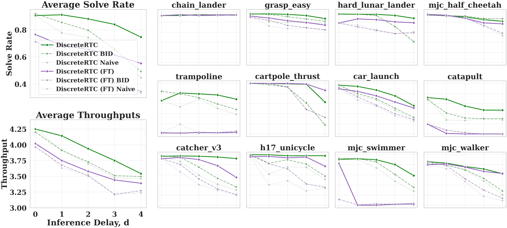

# Inpainting Fine-tuning Ablation

## Summary

As an ablation of the fine-tuning-free claim, we explicitly fine-tune the
pre-trained discrete diffusion policy with an inpainting-specific training
recipe. The result is a consistent performance drop across all 12 Kinetix
levels and every inference delay, supporting the claim that the native
inpainting capability acquired during pre-training already suffices.

## Training Recipe

For each training chunk we construct the target masking pattern in two
stages:

1. **Random mask (standard).** Apply the usual random masking over the full
   action-token sequence, identical to base pre-training.
2. **Prefix unmask (inpainting-specific).** Additionally unmask the first
   few action tokens, exposing the model to the prefix-conditioned pattern
   it will encounter during asynchronous inference.

The intention is to bias the base policy toward the RTC-style
prefix–continuation distribution and, by analogy with training-time
Continuous RTC, further improve inpainting quality.

## Result

The inpainting-finetuned variant (purple) consistently underperforms the
unmodified DiscreteRTC (green) on both **solve rate** and **normalized
throughput**, across every delay $d \in \{0, 1, 2, 3, 4\}$ and every level.
The gap is largest under high-delay regimes, where inpainting matters most.

## Takeaway

A naive prefix-unmasking recipe actually **hurts** the native inpainting
capability of the pre-trained discrete diffusion policy. Improving beyond
the fine-tuning-free DiscreteRTC therefore appears to require either:

- a carefully designed inpainting-aware fine-tuning recipe that does not
  distort the pre-training distribution, or
- directly scaling the base policy's pre-training.

Either way, this negative result reinforces the main claim: **discrete
diffusion policies are already natural asynchronous executors out of the
box**, and ad-hoc inpainting-specific fine-tuning is not the right lever.

## Files

| File | Purpose |
|---|---|
| `FinetuneApp.py` | Combined figure (Avg Solve Rate + Avg Throughputs + 3×4 grid) |
| `FinetuneApp.{png,svg,pdf}` | Full combined figure for the appendix |

## Data

- **Base (DiscreteRTC):** `../data/dd/results.csv`
- **Finetuned variant:** `../data/finetuned/results.csv`

Both cover the same 12 Kinetix levels and delays $d \in \{0, 1, 2, 3, 4\}$
with $s = \max(1, d)$; methods plotted are `RTC`, `BID`, and `Naive`.
